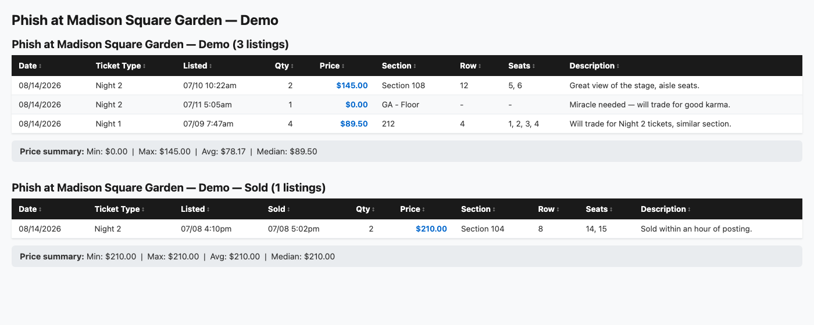

# cashortrade-search

[](https://github.com/dean815/cashortrade-search/actions/workflows/ci.yml)

Search, filter, and sort ticket listings across one or more
[CashorTrade](https://cashortrade.org) events from the command line —
output as a sortable HTML page (default) or a `rich` terminal table.

## Why I built this

Manually refreshing a CashorTrade event page during a ticket drop is slow
and it's easy to miss listings while you're staring at a single page.
This hits the CashorTrade API directly, merges results across as many
event URLs as you give it, and gives me one sortable/filterable view
instead of babysitting a browser tab.

## Install

Requires Python 3.11+.

```bash
git clone https://github.com/dean815/cashortrade-search.git
cd cashortrade-search
pip install -e .
```

This installs a `cashortrade-search` command. (You can also run it directly
without installing: `python tickets.py "URL"`.)

## Usage

```
cashortrade-search "URL1" ["URL2" ...] [options]
```

```bash
cashortrade-search "https://cashortrade.org/phish-at-sphere-tickets/event/<uuid>"
cashortrade-search "URL1" "URL2" --max-price 200 --sort price
cashortrade-search "URL" --section 108 109 110 --type sale miracle
cashortrade-search "URL" --tickets 2-4 --sort date
cashortrade-search "URL1" "URL2" --group-by-event
cashortrade-search "URL" --terminal --sold --sort price-desc
```

### Options

| Flag | Description |
|---|---|
| `urls` | One or more CashorTrade event URLs (required) |
| `--type {sale,trade,miracle}` | Listing types to show (default: `sale miracle`) |
| `--tickets N` or `N-M` | Exact ticket count or range, e.g. `2` or `2-4` |
| `--section ...` | Filter by section(s): numeric patterns match exactly, other patterns (e.g. `GA`) partial-match. Optionally cap a section's row with `:MAXROW`, e.g. `222:7` (rows 1-7 inclusive; GA/floor rows in that section always pass) |
| `--min-price` / `--max-price` | Price bounds per ticket |
| `--show-sold` / `--sold` | Also show a separate "sold" section |
| `--show-only-sold` | Show only sold listings |
| `--sort {price,price-desc,date,date-asc}` | Sort order (default: `price`) |
| `--terminal` | Print a `rich` table instead of opening HTML (default: HTML) |
| `--group-by-event` | Separate tables per event instead of one merged table |

## Output

By default, results open as a self-contained, sortable HTML file in your
browser (click any column header to sort). Pass `--terminal` for a `rich`
table in your terminal instead.



## Notes

- `date`/`date-asc` sort by listing creation date, not the event date. To organize by event date, use `--group-by-event`.
- API requests are throttled and retried automatically to respect cashortrade.org's rate limits.

## How this was built

This repo follows a spec-then-plan workflow before any feature lands —
see [`docs/superpowers/`](docs/superpowers/) for the design specs and
task-by-task implementation plans this tool was actually built from.

## License

MIT — see [LICENSE](LICENSE).
